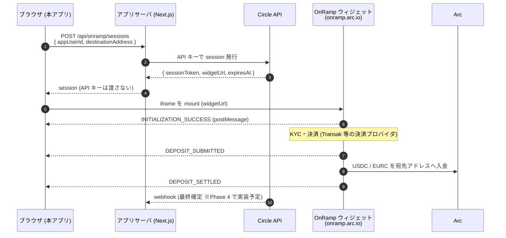

# OnRamp Kit 実験場

Arc の **OnRamp Kit**(`@circle-fin/onramp-kit`)を理解するための学習用サンプルアプリです。法定通貨で Arc 上の USDC / EURC を購入するウィジェットを、自分の Next.js アプリに埋め込み、その挙動を観察します。

> **現在の実装状況**: Phase 2 まで(セッション発行 API、同一オリジン認可、iframe 表示、イベントログ、セッション失効時の再発行、エラー実験)。popup、webhook 突合などは [実装計画書](docs/IMPLEMENTATION_PLAN.md) の Phase 3 以降です。
> **検証状況**: mock モードでの API 動作(200/400/405)、`tsc`、`next build`、**sandbox へのセッション発行(TEST キー)は確認済み**です([検証ログ](docs/verification-log.md))。iframe でのウィジェット表示(localhost、`referrerDomain` 空)も動作を確認しました。セッション失効時の再発行フローは **未検証** です。

## 目次

1. [Arc とは](#1-arc-とは)
2. [App Kit と OnRamp Kit](#2-app-kit-と-onramp-kit)
3. [OnRamp Kit の機能](#3-onramp-kit-の機能)
4. [システム概要](#4-システム概要)
5. [セットアップ](#5-セットアップ)
6. [使い方](#6-使い方)
7. [ディレクトリ構成](#7-ディレクトリ構成)
8. [ハマりどころ](#8-ハマりどころ)
9. [未確認事項](#9-未確認事項)
10. [出典](#10-出典)

## 1. Arc とは

Circle が開発する、ステーブルコイン向けの Layer 1 ブロックチェーンです。支払い、融資、FX、財務管理、エージェント間決済などを想定しています。

| 項目 | 内容 |
| --- | --- |
| コンセンサス | Malachite BFT。テストネットのブロック時間は約 0.48 秒 |
| ファイナリティ | サブ秒の決定的ファイナリティ。チェーン再編(reorg)のリスクなし |
| ガストークン | **USDC がネイティブガス**。手数料がドル建てで予測しやすい |
| 互換性 | EVM 互換。Solidity、Hardhat、Foundry、viem がそのまま使える |
| 対応資産 | USDC、EURC、USYC(オンチェーン利回り) |
| その他 | オプトインのプライバシー(Arc Privacy Sector)、耐量子署名(SLH-DSA-SHA2-128s) |
| ネットワーク状態 | テストネットはバリデータが許可制、開発者アクセスは誰でも可能 |

### Arc Testnet の主な値

| 項目 | 値 |
| --- | --- |
| Chain ID | `5042002` |
| RPC | `https://rpc.testnet.arc.network` |
| USDC | `0x3600000000000000000000000000000000000000` |
| EURC | `0x89B50855Aa3bE2F677cD6303Cec089B5F319D72a` |
| Explorer | https://explorer.testnet.arc.io/ |
| Faucet | https://faucet.circle.com/ |

> **decimals の罠**: USDC はネイティブ(ガス)としては **18 decimals**、ERC-20 インターフェースでは **6 decimals** です。残高計算で混同しないでください。

## 2. App Kit と OnRamp Kit

**App Kit** は、マルチチェーンの決済・流動性ワークフローを 1 つの SDK にまとめた Circle の SDK です(`@circle-fin/app-kit`)。6 つのモジュールがあります。

| モジュール | 役割 |
| --- | --- |
| Bridge | USDC / EURC のチェーン間移動 |
| Swap | トークン交換 |
| Send | 同一チェーン内の送金 |
| Unified Balance | チェーンをまたいだ統合残高 |
| **Onramp** | **法定通貨 → ステーブルコインのウィジェット** |
| Earn | レンディングへの預け入れ |

OnRamp は単体パッケージ `@circle-fin/onramp-kit` としても配布されています。本サンプルは単体版を使います。App Kit 経由の API(`createAppServerKit` など)との差は、Phase 3 で実装して比較する予定です。

## 3. OnRamp Kit の機能

- **埋め込みウィジェット**: KYC、決済、入金までをホスト側が担当します。アプリ側に wallet adapter は不要で、指定アドレスへ直接入金されます。
- **決済手段**: デビットカード、Apple Pay、Google Pay、銀行振込(米国・EU の一部)。一部の手段には Circle Console での KYB が必要です。
- **通貨**: Arc 上の USDC / EURC
- **2 つの表示モード**: `mountIframe`(ページ内に埋め込み)と `openWindow`(ポップアップ)
- **ライフサイクルイベント**: `INITIALIZATION_SUCCESS`、`INITIALIZATION_ERROR`、`DEPOSIT_SUBMITTED`、`DEPOSIT_SETTLED`、`DEPOSIT_NOT_COMPLETED`
- **アセット絞り込み**: セッション作成時に `assets: { tokens, chains, pairs }` で表示する通貨・チェーンを絞れます(複数指定は AND)。表示だけの絞り込みです。
- **セッション**: 約 30 分で失効します。
- **型付きエラー**: `KitError` の `type`(INPUT / NETWORK / SERVICE / RATE_LIMIT / RPC / UNKNOWN)と `recoverability`(RETRYABLE / RESUMABLE / FATAL)で分岐します。

### パッケージの構成

| import | 実行場所 | 役割 |
| --- | --- | --- |
| `@circle-fin/onramp-kit/server` | Node | API キーを短命の `sessionToken` に交換 |
| `@circle-fin/onramp-kit` | ブラウザ | ウィジェットの起動(iframe / popup) |
| `@circle-fin/onramp-kit/protocol` | 両方 | イベント封筒、セッション型、定数 |
| `@circle-fin/onramp-kit/mocks` | テスト | サーバ・クライアントのインメモリ mock |

## 4. システム概要

API キーは長期有効な秘密情報なので、**ブラウザには渡しません**。サーバが per-user の `sessionToken` を発行し、ブラウザにはその token だけを渡します。



### 重要な原則: ブラウザイベントは「UI 用の通知」、真実は webhook

ブラウザのイベントは best-effort です。送信後にユーザーがタブを閉じると、入金がサーバ側で完了しても `DEPOSIT_SETTLED` は届きません。「`DEPOSIT_SETTLED` が来ない = 入金なし」と扱わず、最終状態は Circle のサーバ側 webhook で確認します。

### モード

| `ONRAMP_MODE` | 動作 |
| --- | --- |
| `mock`(既定) | `onramp-kit/mocks` を使用。外部依存なしで API 動作を確認できる(ウィジェット自体はダミー URL) |
| `sandbox` | `api-test.circle.com` / `onramp-sandbox.arc.io` |
| `production` | `api.circle.com` / `onramp.arc.io`(実装のみ。実行は非推奨) |

## 5. セットアップ

### 前提

- Node.js 22 以上(SDK 自体は 20 以上)と [Bun](https://bun.sh)
- Circle Console で発行した OnRamp 用 API キー(mock モードだけなら不要)
- 入金先の EOA アドレス(MetaMask 等)

### 手順

```bash
cd onramp-kit-sample
bun install
cp .env.example .env.local
```

`.env.local` を編集します。

```bash
ONRAMP_MODE=sandbox              # まず mock で試すなら mock のまま
ONRAMP_API_KEY=<Console で発行された文字列をそのまま>
ONRAMP_REFERRER_DOMAIN=          # 空でよい。埋め込みに失敗したら §8 を参照
```

`ONRAMP_API_KEY` は `<ENV>_API_KEY:<keyId>:<keySecret>` 形式で、加工せずそのまま使います。`.env.local` は git 管理から除外されています。

### セッション発行の疎通確認(実 API)

```bash
ONRAMP_MODE=sandbox bun --env-file=.env.local run smoke:session <あなたのEOAアドレス>
```

キーの環境プレフィックスと発行結果を表示します。秘密値(token など)は伏せて出力します。

## 6. 使い方

```bash
bun run dev          # http://localhost:3000
bun run typecheck    # 型チェック
bun run build        # 本番ビルド
```

1. http://localhost:3000/lab/iframe を開く
2. 入金先の EOA アドレス(Arc Testnet)を入力
3. 「購入を開始」を押すと、セッションが発行されてウィジェットが表示される
4. 下部のイベントログに、ウィジェットからのイベントが `on('*')` で時系列に並ぶ

### API

`POST /api/onramp/sessions`

```json
{ "appUserId": "demo-user", "destinationAddress": "0x…", "assets": { "chains": ["arc"] } }
```

| 状況 | ステータス |
| --- | --- |
| 正常 | 200(`Cache-Control: no-store`) |
| body が不正 | 400 |
| POST 以外 | 405 |

> **認可**: 同一オリジン(`Origin` と `Host` の一致)のリクエストだけを許可します(fail-closed。Origin が無ければ 401)。これは CSRF 対策の最低限で、ユーザー認証ではありません。公開する場合は自前のセッション認証に置き換えてください。

### エラー実験

http://localhost:3000/lab/errors は、セッション発行 API に `?fault=invalid-key` を付けて不正な API キーで失敗させます(本番ビルドでは無効)。sandbox で次の結果を確認済みです。

| 項目 | 値 |
| --- | --- |
| HTTP | 400 |
| code / name / type | `1907` / `INPUT_INVALID_API_KEY` / `INPUT` |

### テスト

```bash
bun run test    # vitest。mock モードで認可とルートを検証 (7 件)
```

### sandbox でのテスト用入力値

ウィジェットの KYC・決済画面では、次の **テスト用の値だけ** を入力します。実在する個人情報(自分の電話番号・生年月日・カード番号など)は入力しないでください。

> **前提**: アドレスバーが `onramp-sandbox.arc.io` であること。`onramp.arc.io`(本番)に架空の値を入力してはいけません。
>
> **出典と確度**: 以下は決済プロバイダ Transak の公式ドキュメント([How to Test Using Sandbox Credentials](https://docs.transak.com/guides/sandbox-credentials))の値です。Arc の OnRamp sandbox が同じ設定かは Arc の docs では確認できていません。動かない場合は値が異なる可能性があります。

| 項目 | 値 |
| --- | --- |
| Country | US (+1) |
| Phone number | `2125550142`(`+12125550142`) |
| 電話の確認コード(OTP) | `999999` |
| Date of birth | `01-01-1998`(画面の入力順に合わせる) |
| 名前 | First: `Doe` / Last: `Jane` |
| SSN(米国アカウント作成時) | `123456789` |
| 住所(米国) | 179 Richmond Oak / California / CA / 94016 |
| テストカード(VISA・3DS あり・USD) | `4024764449971519`、有効期限 `10/33`、CVV `123` |
| 3DS のパスワード | `Checkout1!` |

シナリオを切り替えるためのメールアドレスの別名(staging):

| 目的 | メールアドレスの例 |
| --- | --- |
| 失敗した注文を再現 | `xyz+failed@abc.com` |
| 返金を再現 | `xyz+refund@abc.com` |

> Transak によると、staging の KYC 結果は常に承認されます。ただし、アカウント作成と個人情報の入力画面は通る必要があります。

## 7. ディレクトリ構成

```
onramp-kit-sample/
├── docs/IMPLEMENTATION_PLAN.md      # 実装計画書 (調査結果・フェーズ計画)
├── scripts/smoke-session.ts         # 実 API での session 発行確認
├── tests/                           # vitest (認可・ルート)
├── next.config.ts                   # CSP ヘッダ (frame-src / connect-src)
└── src/
    ├── app/api/onramp/sessions/     # session 発行ルート
    ├── app/lab/iframe/              # iframe 実験ページ
    ├── components/OnrampFrame.tsx   # widget 起動・イベントログ
    └── lib/onramp/{mode,server,authorize}.ts  # モード切替・サーバ kit 生成・認可
```

## 8. ハマりどころ

| 症状 | 原因と対処 |
| --- | --- |
| iframe が真っ白で、エラーも出ない | CSP に widget / API の origin が無い。ブラウザが読み込み前にブロックするため、イベントも出ない。`next.config.ts` の `frame-src` / `connect-src` を確認 |
| iframe が表示されない(高さ 0) | 別オリジンの iframe は中身に合わせて伸びない。コンテナに明示的な高さ(720px 等)が必要 |
| iframe が埋め込めない | `referrerDomain` の設定漏れ、または値が不正の可能性。ホスト名のみ(scheme・port・path・`*` は不可)で、実際にアクセスしているホストと一致させる。localhost で失敗する場合は cloudflared / ngrok のホスト名を設定し、その URL でアクセスする。`referrerDomain` は起動時に読まれるので、変更後は dev サーバを再起動 |
| iOS Safari で KYC が失敗する | ITP による iframe 内ストレージ制限。popup モード(`openWindow`)を推奨(Phase 3 で実装予定) |
| ポップアップが開かない | `openWindow` は click ハンドラ内で同期的に呼ぶ必要がある。`await` の後だとブロックされる |
| 表示後に `INVALID_SESSION_TOKEN` / `SESSION_TIMEOUT` | セッションは約 30 分で失効する。再発行して再 mount する |

## 9. 未確認事項

推測で実装せず、実機で確認してから更新します。

- ~~sandbox の利用可否~~ → **確認済み**: TEST キーで `api-test.circle.com` からセッションを発行できた(npm 型定義の「no public sandbox」コメントは古いとみられる)
- kit key(`KIT_KEY:…`)と API キーの違い(今回は `TEST_API_KEY` 形式の API キーで発行できた)
- sandbox で localhost から埋め込めるか(ブラウザでの表示確認が必要)
- Early Access NDA が利用の必須条件か
- webhook の署名検証方式とペイロード
- npm パッケージに Arc メインネットへの参照(`rpc.mainnet.arc.io` など)があるため、テストネット前提の記述を見直す必要があるか
- 決済プロバイダは型定義の記述から Transak と読み取れるが、公式 docs での明記は未確認

## 10. 出典

いずれも 2026-09-26 に確認しました。仕様は変わりうるので、実装前に再確認してください。

- [Arc docs: Onramp](https://docs.arc.io/app-kit/onramp)
- [Quickstart: Embed the Onramp widget](https://docs.arc.io/app-kit/quickstarts/onramp-embed-widget.md)
- [Customize session minting](https://docs.arc.io/app-kit/tutorials/onramp/customize-session-minting.md)
- [Handle lifecycle events](https://docs.arc.io/app-kit/tutorials/onramp/handle-lifecycle-events.md)
- [Choose iframe or popup mode](https://docs.arc.io/app-kit/tutorials/onramp/iframe-vs-popup.md)
- [Hosting requirements](https://docs.arc.io/app-kit/references/onramp-hosting-requirements.md)
- [Error handling](https://docs.arc.io/app-kit/references/onramp-error-handling.md)
- [Arc Network Overview](https://docs.arc.io/arc-chain.md) / [Contract Addresses](https://docs.arc.io/arc/references/contract-addresses.md)
- [App Kit Overview](https://docs.arc.io/app-kit.md)
- [`@circle-fin/onramp-kit`(npm, v1.0.2)](https://www.npmjs.com/package/@circle-fin/onramp-kit) の README・型定義
- [circlefin/onramp-kit-demo](https://github.com/circlefin/onramp-kit-demo) / [circlefin/arc-fintech PR #47](https://github.com/circlefin/arc-fintech/pull/47)
- [OnRamp デモ](https://onramp-demo.arc.io/partner-demo/v1)
- [How to Test Using Sandbox Credentials | Transak](https://docs.transak.com/guides/sandbox-credentials) / [Is KYC required on the STAGING environment?](https://support.transak.com/en/articles/7845947-is-kyc-required-on-the-staging-environment)
